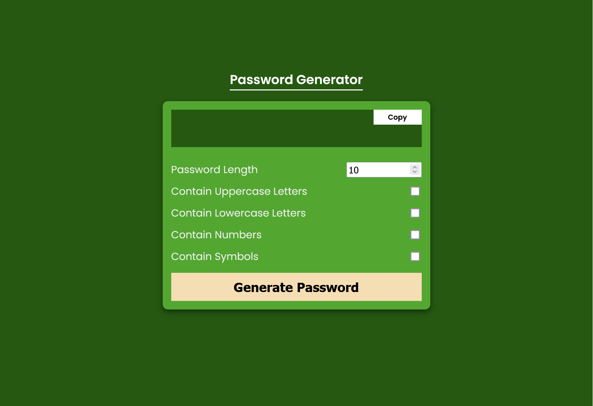

# Password Generator

This is a simple password generator web application built using HTML, CSS, and JavaScript. It allows users to generate random passwords with customizable length and character types.

## Features

- Generate passwords with specified length (between 2 and 20 characters).
- Include or exclude uppercase letters, lowercase letters, numbers, and symbols in the generated password.
- Copy generated passwords to clipboard with a single click.

## Usage

1. Open the `index.html` file in your web browser.
2. Choose the desired password length using the input field.
3. Check or uncheck the options to include or exclude uppercase letters, lowercase letters, numbers, and symbols.
4. Click the "Generate Password" button to generate a password.
5. Click the "Copy" button to copy the generated password to your clipboard.

## Contributing

Contributions are welcome! If you find any bugs or have suggestions for improvements, please open an issue or submit a pull request.
